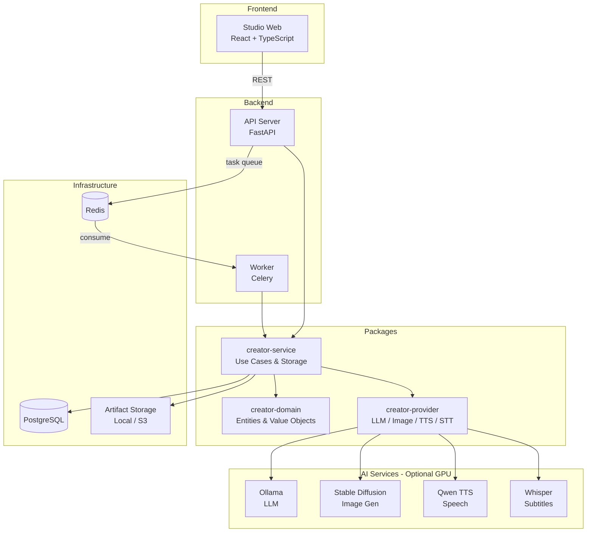
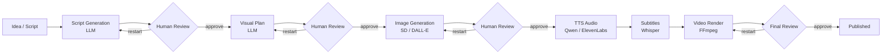
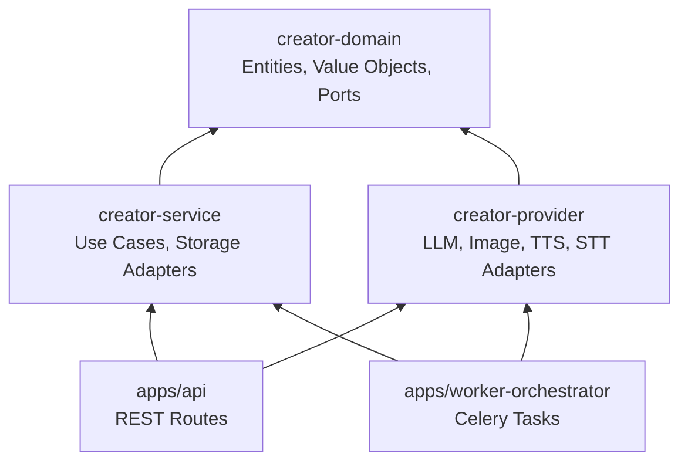

# Short Form Studio

AI-powered short-form video production pipeline -- from idea to rendered video in minutes.

## Overview

Short Form Studio is an open-source platform that automates short-form video creation using AI.
It takes an idea or structured script and produces a complete video with:

- AI-generated scripts (via LLM)
- Visual plans and image generation (via Stable Diffusion or DALL-E)
- Text-to-speech narration (via local Qwen TTS or ElevenLabs/OpenAI)
- Auto-generated subtitles (via Whisper STT)
- Final video rendering (via FFmpeg)

The pipeline is stage-based with human-in-the-loop review at each step.

## Architecture

The project is a monorepo with these main components:

| Component | Path | Description |
|---|---|---|
| **API** | `apps/api/` | FastAPI REST API -- orchestrates the pipeline |
| **Worker** | `apps/worker-orchestrator/` | Celery worker -- runs async AI tasks |
| **Studio Web** | `apps/studio-web/` | React + TypeScript frontend (Vite dev / nginx production) |
| **Domain** | `packages/creator-domain/` | Shared domain models (Pydantic) |
| **Service** | `packages/creator-service/` | Business logic and database layer |
| **Providers** | `packages/creator-provider/` | LLM, Image, TTS, STT provider adapters |

### System Architecture



### Pipeline Flow



### Package Dependencies



## Pipeline Stages

```
IDEA_READY -> SCRIPT_GENERATING -> SCRIPT_REVIEW
  -> VISUAL_PLAN_SETUP -> VISUAL_PLAN_GENERATING -> VISUAL_PLAN_REVIEW
  -> VISUAL_ASSET_GENERATING -> VISUAL_ASSET_REVIEW
  -> AUDIO_GENERATING -> SUBTITLE_GENERATING
  -> RENDER_GENERATING -> FINAL_REVIEW -> PUBLISHED
```

Each `*_REVIEW` stage requires explicit approval before advancing.

## Quick Start

### Prerequisites

- Docker and Docker Compose v2+
- (Optional) NVIDIA GPU + Container Toolkit for local AI models

### 1. Clone and configure

```bash
git clone https://github.com/yeongseon/short-form-studio.git
cd short-form-studio
cp .env.example .env
# Edit .env as needed

> **Security:** The `.env.example` file contains placeholder passwords. Always change
> `POSTGRES_PASSWORD` and `DATABASE_URL` credentials before running in any shared or
> production environment.
```

### 2. Start services

```bash
docker compose up -d
```

This starts the core services (API, worker, frontend, database, Redis). Local GPU-based AI
services (Ollama, Stable Diffusion, TTS, STT) are optional and gated behind a Docker Compose
profile. To start them alongside the core stack:

```bash
docker compose --profile gpu up -d
```

> **Note:** GPU services require an NVIDIA GPU with the Container Toolkit installed.
> Without a GPU, configure remote AI providers via API keys in `.env` instead.
> The `stable-diffusion`, `tts-qwen3`, and `stt-whisper` GPU services are optional and
> require pre-built local images that are not currently shipped in this repository.
> Expected image names are `shorts-automation-stable-diffusion`,
> `shorts-automation-tts-qwen3`, and `shorts-automation-stt-whisper` with tags like
> `:latest` for local iteration or versioned tags such as `:1.0.0` for reproducible deploys.
> **Development:** `docker compose -f docker-compose.yml -f docker-compose.dev.yml up -d`
> enables backend/worker source mounting, but does not provide frontend live-reload.
> For frontend development, run `cd apps/studio-web && npm run dev` directly.

> **Security:** `studio-web` binds to `127.0.0.1:5174` by default so the UI is not exposed on the local network.
> For public deployments, keep this behind an authenticated reverse proxy and add proper application authentication.

### 3. Run database migrations

```bash
docker compose run --rm api alembic upgrade head
```

### 4. (Optional) Pull the default LLM model

Only needed when using the `gpu` profile for local AI inference.

```bash
docker compose --profile gpu up -d ollama
# Wait for the container to be healthy, then:
docker compose exec ollama ollama pull qwen3:4b
```

> Skip this step if you use remote LLM providers (OpenAI, Anthropic, Google).

### 5. Open the Studio

Navigate to `http://localhost:5174` to start creating.

## Supported AI Providers

### Local (GPU required)

| Category | Provider | Model |
|---|---|---|
| LLM | Ollama | qwen3:4b |
| Image | Stable Diffusion | SD 1.5 |
| TTS | Qwen TTS | Local |
| STT | Whisper | small (configurable) |

### Remote (API key required)

| Category | Provider | Model | Env Variable |
|---|---|---|---|
| LLM | OpenAI | GPT-4o Mini | `OPENAI_API_KEY` |
| LLM | Anthropic | Claude Sonnet | `ANTHROPIC_API_KEY` |
| LLM | Google | Gemini 2.0 Flash | `GOOGLE_API_KEY` |
| Image | OpenAI | DALL-E 3 | `OPENAI_API_KEY` |
| Image | Stability AI | SD3 Medium | `STABILITY_API_KEY` |
| Image | Google | Imagen 3 | `GOOGLE_API_KEY` |
| TTS | ElevenLabs | Multilingual v2 | `ELEVENLABS_API_KEY` |
| TTS | OpenAI | TTS-1 | `OPENAI_API_KEY` |

## Configuration

See [`.env.example`](.env.example) for all configuration options.

Key settings:

| Variable | Description | Default |
|---|---|---|
| `API_KEY` | API authentication key (leave empty for open access) | _(empty)_ |
| `CORS_ORIGINS` | Allowed CORS origins | `http://localhost:5174` |
| `ARTIFACT_ROOT` | Path for generated artifacts | `./data/artifacts` |
| `OLLAMA_DEFAULT_MODEL` | Default LLM model | `qwen3:4b` |

## Development

### Backend

```bash
# Lint
python3 -m ruff check apps packages

# Run API locally
cd apps/api && uvicorn shorts_api.main:app --reload
```

> **Reproducibility:** The repository includes a `constraints.txt` file that pins all
> transitive Python dependencies. CI and Docker builds install against it. To regenerate
> after updating dependencies: `pip freeze > constraints.txt`.

### Frontend

```bash
cd apps/studio-web
npm ci
npm run dev      # Development server
npm run build    # Production build
npm test         # Run tests
```

### Running Tests

```bash
# Backend tests
python3 -m pytest apps/api/tests/ -x -v

# Frontend tests
cd apps/studio-web && npm test
```

## Service Ports

| Service | Port | Protocol |
|---|---|---|
| API (FastAPI) | 8000 | HTTP |
| Studio Web (Vite dev / nginx prod) | 5174 | HTTP |
| PostgreSQL | 5432 | TCP |
| Redis | 6379 | TCP |
| Ollama | 11434 | HTTP |
| Stable Diffusion | 7860 | HTTP |
| TTS (Qwen) | 8100 | HTTP |
| STT (Whisper) | 9000 | HTTP |
| Flower (monitoring) | 5555 | HTTP |

## Documentation

- [Usage Guide](docs/USAGE.md) -- Detailed feature walkthrough
- [Deployment Guide](docs/CUTOVER.md) -- Production deployment checklist

## License

This project is open source. See [LICENSE](LICENSE) for details.

## Contributing

Contributions are welcome. Please open an issue first to discuss what you would like to change.
