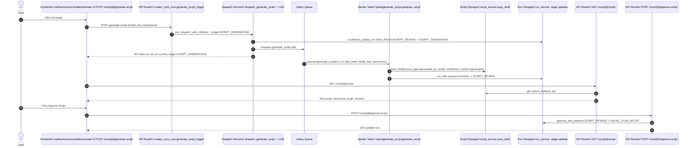

# Vertical Slice: Script Generation

This document traces the script-generation flow end-to-end across frontend, API, worker orchestration, draft storage, and review approval.

## Sequence Diagram

## Step-by-Step Flow

1. Frontend trigger
   - `apps/studio-web/src/pages/project/useRunActions.ts` (`handleGenerate`) calls `POST /api/creator/runs/{run_id}/generate-script`.
2. API validation and dispatch
   - `apps/api/src/shorts_api/routes/creator_runs_core.py` validates stage and model key, resolves idea brief from project, then calls `cas_dispatch_with_rollback(...)`.
3. Task dispatch and CAS guard
   - `packages/creator-service/creator_service/task_dispatch_service.py` performs a compare-and-swap stage update to `SCRIPT_GENERATING`, enqueues `tasks.generate_script.apply_async`, and returns the task id.
4. Worker execution
   - `apps/worker-orchestrator/tasks/generate_script.py` builds prompt, calls provider, persists output via `script_service.save_draft(...)`, and completes through task runner with success stage `SCRIPT_REVIEW`.
5. Script retrieval
   - `apps/api/src/shorts_api/routes/creator_script.py` (`GET /runs/{run_id}/script`) returns the active draft content for review stages.
6. Review and approval
   - `apps/api/src/shorts_api/routes/creator_runs_core.py` (`POST /runs/{run_id}/approve-script`) advances run from `SCRIPT_REVIEW` to `VISUAL_PLAN_SETUP`.

## State Transitions in This Slice

- Dispatch start: `IDEA_READY` or `SCRIPT_REVIEW` -> `SCRIPT_GENERATING`
- Worker success: `SCRIPT_GENERATING` -> `SCRIPT_REVIEW`
- Human/agent approval: `SCRIPT_REVIEW` -> `VISUAL_PLAN_SETUP`
- Failure safety: CAS/dispatch failures roll back to prior stage through `cas_dispatch_with_rollback`.
